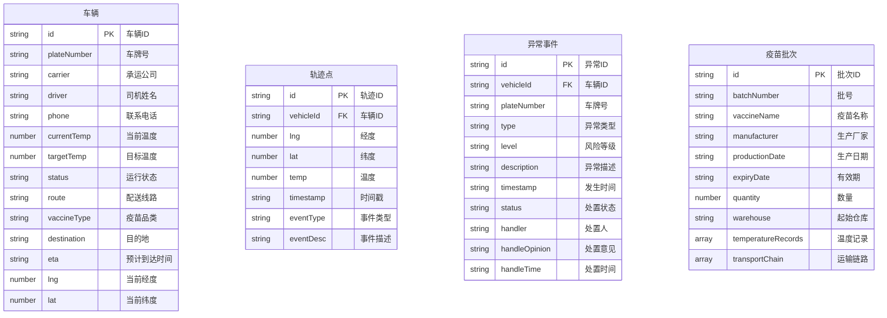

## 1. 架构设计

```mermaid
flowchart LR
    "浏览器层" --> "React 前端应用"
    "React 前端应用" --> "Zustand 状态管理"
    "React 前端应用" --> "Mock 数据服务"
    "React 前端应用" --> "UI 组件库"
    "UI 组件库" --> "地图可视化组件"
    "UI 组件库" --> "图表可视化组件"
    "UI 组件库" --> "数据表格组件"
    "Mock 数据服务" --> "车辆数据"
    "Mock 数据服务" --> "异常数据"
    "Mock 数据服务" --> "批次档案数据"
```

## 2. 技术说明

- **前端框架**：React 18 + TypeScript
- **构建工具**：Vite 5
- **样式方案**：Tailwind CSS 3
- **状态管理**：Zustand
- **路由管理**：React Router DOM 6
- **图表可视化**：Chart.js + react-chartjs-2（温度曲线图、统计图）
- **地图可视化**：自定义 SVG 地图组件（模拟省市级地图）
- **图标库**：Lucide React
- **后端服务**：无后端，使用 Mock 数据模拟 API
- **数据持久化**：LocalStorage（处置记录缓存）

## 3. 路由定义

| 路由 | 用途 |
|------|------|
| / | 重定向至 /map-overview |
| /map-overview | 地图总览 - 车辆实时监控与轨迹查看 |
| /exception-handling | 异常处置 - 异常事件列表与处置操作 |
| /batch-archives | 批次档案 - 疫苗批号查询与追溯 |

## 4. 数据模型

### 4.1 数据模型定义



### 4.2 数据模型 TypeScript 定义

```typescript
// 车辆状态
type VehicleStatus = 'in-transit' | 'stopped' | 'loading' | 'arrived';
type RiskLevel = 'high' | 'medium' | 'low';
type ExceptionType = 'over-temperature' | 'long-stop' | 'route-deviation' | 'door-open';
type ExceptionStatus = 'pending' | 'handling' | 'resolved';

interface Vehicle {
  id: string;
  plateNumber: string;
  carrier: string;
  driver: string;
  phone: string;
  currentTemp: number;
  targetTemp: number;
  status: VehicleStatus;
  route: string;
  vaccineType: string;
  destination: string;
  eta: string;
  lng: number;
  lat: number;
}

interface TrackPoint {
  id: string;
  vehicleId: string;
  lng: number;
  lat: number;
  temp: number;
  timestamp: string;
  eventType: 'normal' | 'loading' | 'unloading' | 'stop' | 'door-open' | 'door-close';
  eventDesc: string;
}

interface ExceptionEvent {
  id: string;
  vehicleId: string;
  plateNumber: string;
  type: ExceptionType;
  level: RiskLevel;
  description: string;
  timestamp: string;
  status: ExceptionStatus;
  handler?: string;
  handleOpinion?: string;
  handleTime?: string;
  temperature?: number;
  location?: string;
}

interface TemperatureRecord {
  timestamp: string;
  temp: number;
}

interface TransportNode {
  type: 'warehouse' | 'vehicle' | 'station';
  name: string;
  person: string;
  time: string;
  description: string;
}

interface VaccineBatch {
  id: string;
  batchNumber: string;
  vaccineName: string;
  manufacturer: string;
  productionDate: string;
  expiryDate: string;
  quantity: number;
  warehouse: string;
  temperatureRecords: TemperatureRecord[];
  transportChain: TransportNode[];
}
```

## 5. 目录结构

```
src/
├── components/          # 通用组件
│   ├── Layout/         # 布局组件（侧边栏、顶部栏）
│   ├── MapView/        # 地图相关组件
│   ├── VehicleCard/    # 车辆信息卡片
│   ├── StatsCard/      # 统计卡片
│   ├── TempChart/      # 温度曲线图
│   ├── Timeline/       # 时间轴组件
│   └── RiskBadge/      # 风险等级标签
├── pages/              # 页面组件
│   ├── MapOverview.tsx    # 地图总览
│   ├── ExceptionHandling.tsx  # 异常处置
│   └── BatchArchives.tsx # 批次档案
├── store/              # Zustand 状态管理
│   ├── vehicleStore.ts
│   ├── exceptionStore.ts
│   └── batchStore.ts
├── mock/               # Mock 数据
│   ├── vehicles.ts
│   ├── exceptions.ts
│   └── batches.ts
├── types/              # TypeScript 类型定义
│   └── index.ts
├── utils/              # 工具函数
│   ├── format.ts
│   └── mapUtils.ts
├── App.tsx
├── main.tsx
└── index.css
```

## 6. 关键实现方案

### 6.1 地图可视化方案
- 使用自定义 SVG 绘制省级/市级行政区域轮廓作为底图
- 车辆标记使用 SVG 图标，通过 CSS transform 定位
- 轨迹线使用 SVG polyline 绘制，支持动画效果
- 不同状态车辆使用不同颜色（绿色正常、黄色预警、红色异常）

### 6.2 温度曲线图
- 使用 Chart.js 绘制折线图
- 支持 2-8℃ 安全区间背景着色
- 超温区间红色高亮显示
- 支持时间范围缩放

### 6.3 状态管理
- 使用 Zustand 管理全局状态
- 车辆数据、异常数据、批次数据分别独立 store
- 支持筛选条件持久化到 URL 参数

### 6.4 交互动效
- CSS transitions 实现平滑过渡
- 关键状态变更使用 CSS keyframes 动画
- 地图轨迹回放使用 requestAnimationFrame 控制
